# WheelGo System Architecture

## Table of Contents
- [System Overview](#system-overview)
- [High-Level Architecture](#high-level-architecture)
- [Component Details](#component-details)
- [Data Models](#data-models)
- [API Endpoints](#api-endpoints)
- [User Flows](#user-flows)
- [Database Schema](#database-schema)

---

## System Overview

WheelGo is a **bike rental platform** that connects customers with vendors who offer bikes for rent. The system consists of three main components:

| Component | Technology | Purpose |
|-----------|------------|---------|
| **Backend** | Django REST Framework | API server, business logic, data persistence |
| **Customer App** | React Native (Expo) | Customer-facing mobile app |
| **Vendor App** | React Native (Expo) | Vendor-facing mobile app |

---

## High-Level Architecture

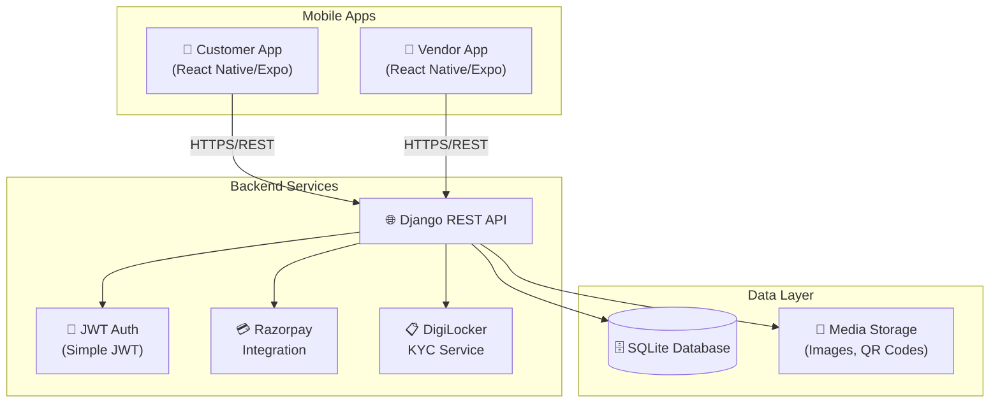

---

## Component Details

### Backend Architecture

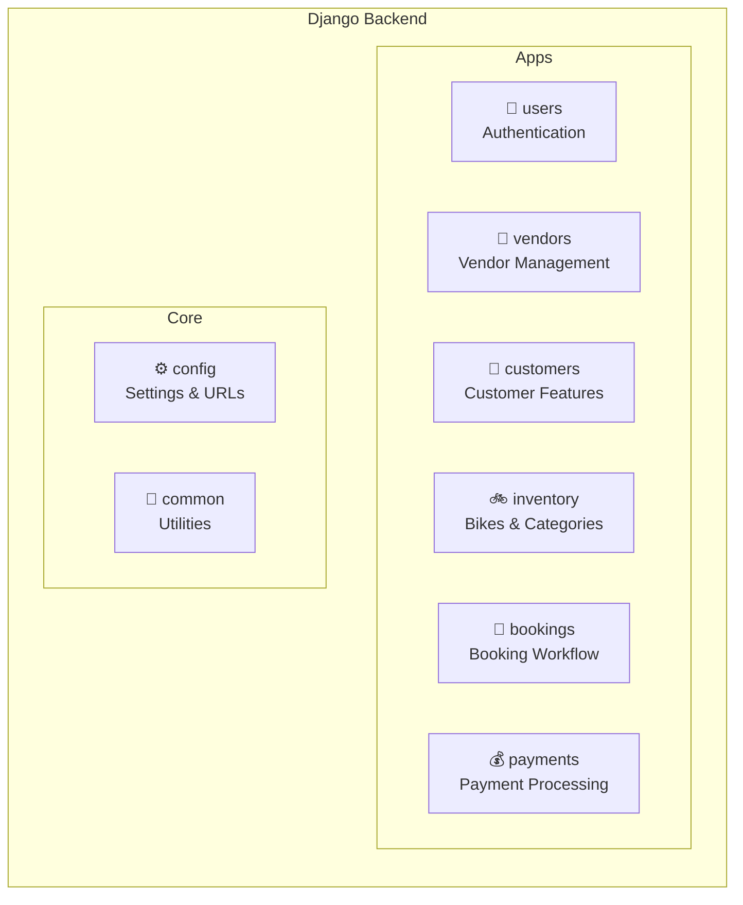

### Frontend Apps Structure

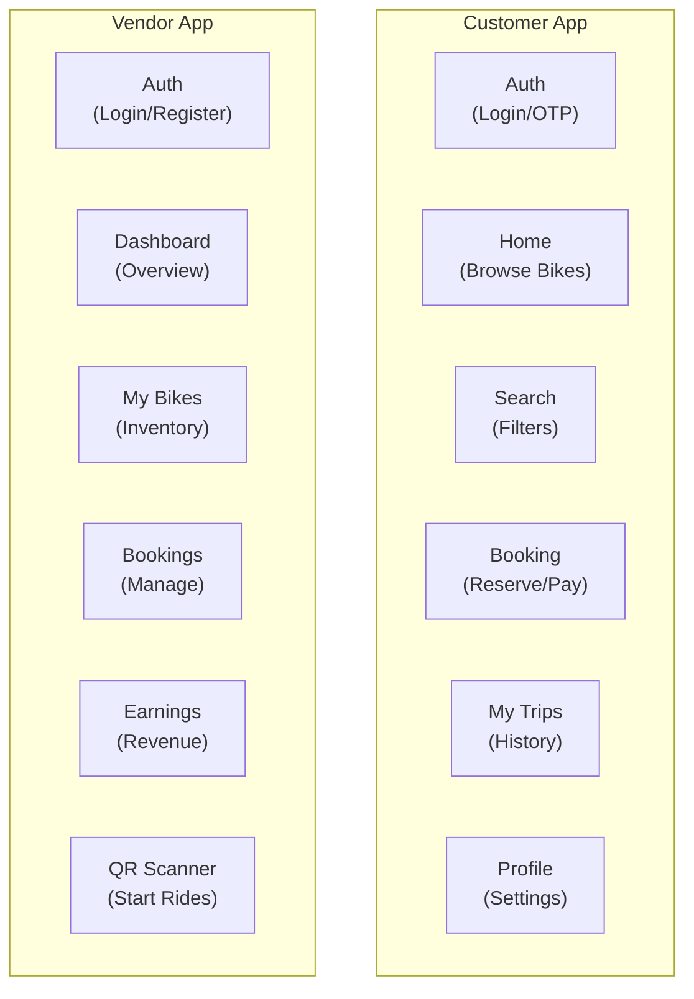

---

## Data Models

### Entity Relationship Diagram

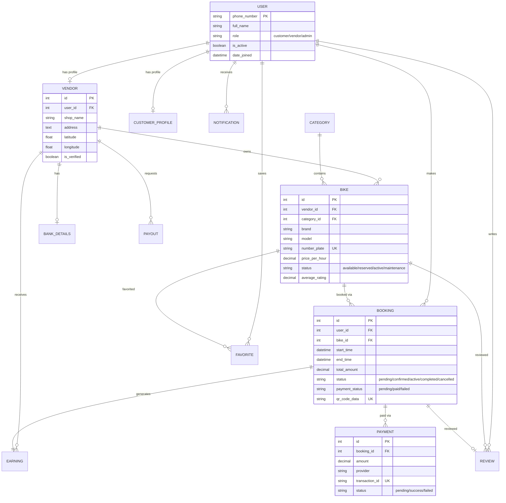

### Model Details

| Model | App | Key Fields | Purpose |
|-------|-----|------------|---------|
| `User` | users | phone_number, role, full_name | Base authentication |
| `PhoneOTP` | users | phone_number, otp, verified | OTP verification |
| `Vendor` | vendors | shop_name, address, location, is_verified | Vendor business profile |
| `VendorBankDetails` | vendors | account_number, ifsc_code | Payout bank info |
| `Earning` | vendors | gross_amount, platform_fee (15%), net_amount | Per-booking earnings |
| `Payout` | vendors | amount, status, utr | Payout requests |
| `CustomerProfile` | customers | avatar, email, saved_address, is_kyc_verified | Extended customer info |
| `Favorite` | customers | user, bike | Saved bikes |
| `Review` | customers | rating (1-5), comment | Post-ride reviews |
| `CustomerNotification` | customers | type, title, message, is_read | Push notifications |
| `Category` | inventory | name, description, image | Bike categories |
| `Bike` | inventory | brand, model, number_plate, price_per_hour, status | Vehicle inventory |
| `Booking` | bookings | start_time, end_time, status, qr_code | Rental bookings |
| `Payment` | payments | amount, transaction_id, status | Payment records |

---

## API Endpoints

### Authentication (`/api/users/`)

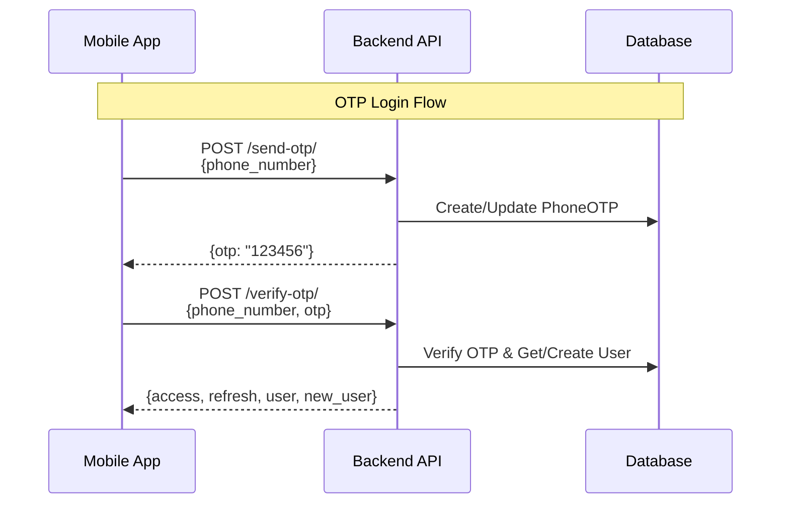

| Endpoint | Method | Auth | Description |
|----------|--------|------|-------------|
| `/send-otp/` | POST | ❌ | Send OTP to phone number |
| `/verify-otp/` | POST | ❌ | Verify OTP & get JWT tokens |
| `/check-user/` | POST | ❌ | Check if user exists |

---

### Inventory (`/api/inventory/`)

| Endpoint | Method | Auth | Description |
|----------|--------|------|-------------|
| `/categories/` | GET | ❌ | List all bike categories |
| `/bikes/` | GET | ❌ | List bikes (with filters) |
| `/bikes/` | POST | ✅ Vendor | Add new bike |
| `/bikes/{id}/` | GET | ❌ | Get bike details |
| `/bikes/{id}/` | PUT/PATCH | ✅ Vendor | Update bike |
| `/bikes/{id}/toggle-availability/` | POST | ✅ Vendor | Toggle bike status |

**Bike Query Parameters:**
- `category`, `category_name` - Filter by category
- `status` - Filter by availability
- `min_price`, `max_price` - Price range
- `min_rating` - Minimum rating filter
- `lat`, `lng`, `radius` - Location-based search
- `search` - Text search (brand/model)
- `sort_by` - price_low, price_high, rating, newest

---

### Bookings (`/api/bookings/`)

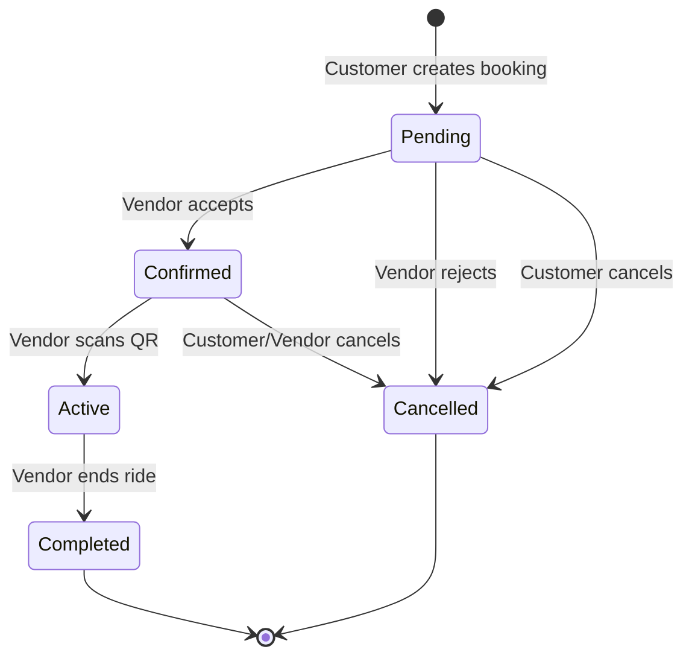

| Endpoint | Method | Auth | Description |
|----------|--------|------|-------------|
| `/` | GET | ✅ | List bookings (filtered by role) |
| `/` | POST | ✅ Customer | Create new booking |
| `/{id}/` | GET | ✅ | Get booking details |
| `/{id}/accept/` | POST | ✅ Vendor | Accept pending booking |
| `/{id}/reject/` | POST | ✅ Vendor | Reject booking with reason |
| `/{id}/cancel/` | POST | ✅ | Cancel booking |
| `/{id}/complete/` | POST | ✅ Vendor | End active ride |
| `/{id}/qr-code/` | GET | ✅ Customer | Get QR code image |
| `/scan-qr/` | POST | ✅ Vendor | Scan QR to start ride |

---

### Payments (`/api/payments/`)

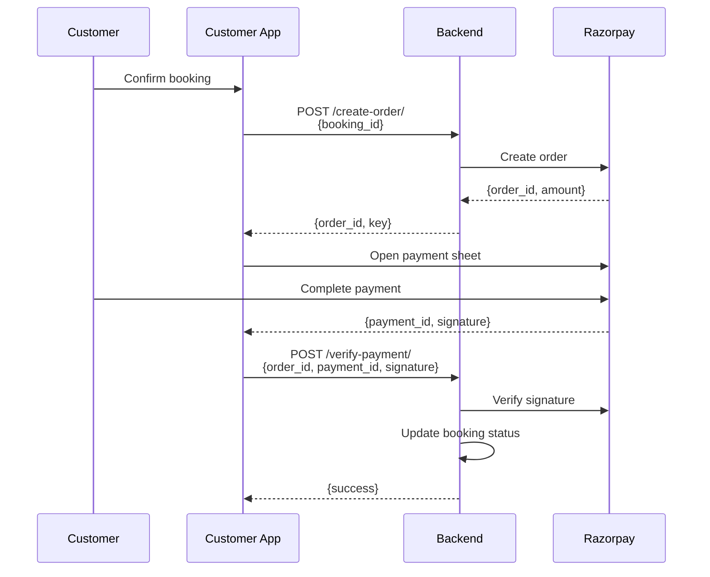

| Endpoint | Method | Auth | Description |
|----------|--------|------|-------------|
| `/create-order/` | POST | ✅ | Create Razorpay order |
| `/verify-payment/` | POST | ✅ | Verify payment signature |

---

### Vendors (`/api/vendors/`)

| Endpoint | Method | Auth | Description |
|----------|--------|------|-------------|
| `/profile/` | GET | ✅ | Get vendor profile |
| `/profile/` | POST | ✅ | Create/update vendor profile |
| `/bank-details/` | GET | ✅ | Get bank account info |
| `/bank-details/` | POST | ✅ | Add/update bank details |
| `/earnings/` | GET | ✅ | List all earnings |
| `/earnings/summary/` | GET | ✅ | Get earnings totals |
| `/payouts/` | GET | ✅ | List payout history |
| `/payouts/request/` | POST | ✅ | Request new payout |
| `/kyc/initiate/` | POST | ✅ | Start DigiLocker KYC |
| `/kyc/check-status/` | POST | ✅ | Check KYC status |

---

### Customers (`/api/customers/`)

| Endpoint | Method | Auth | Description |
|----------|--------|------|-------------|
| `/profile/` | GET/POST | ✅ | Get/update customer profile |
| `/dashboard/` | GET | ✅ | Dashboard with stats |
| `/favorites/` | GET | ✅ | List favorite bikes |
| `/favorites/` | POST | ✅ | Add to favorites |
| `/favorites/{bike_id}/` | DELETE | ✅ | Remove from favorites |
| `/reviews/` | GET | ✅ | List user's reviews |
| `/reviews/` | POST | ✅ | Submit review |
| `/reviews/bike/{bike_id}/` | GET | ✅ | Reviews for a bike |
| `/notifications/` | GET | ✅ | List notifications |
| `/notifications/{id}/read/` | POST | ✅ | Mark as read |
| `/notifications/read-all/` | POST | ✅ | Mark all as read |

---

## User Flows

### Customer Booking Flow

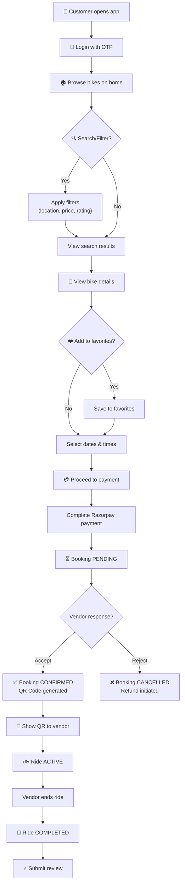

### Vendor Workflow

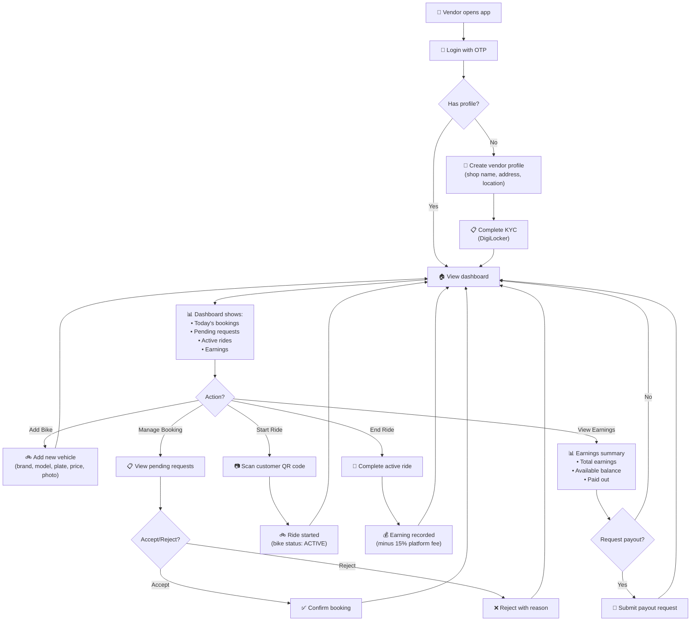

### Data Flow: Complete Booking Lifecycle

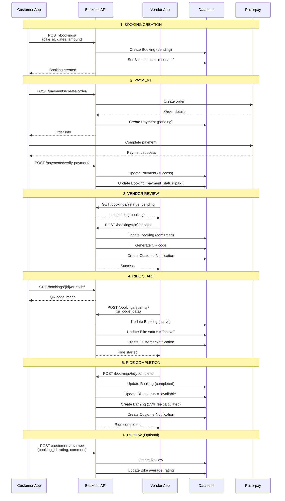

---

## Database Schema

### Tables Overview

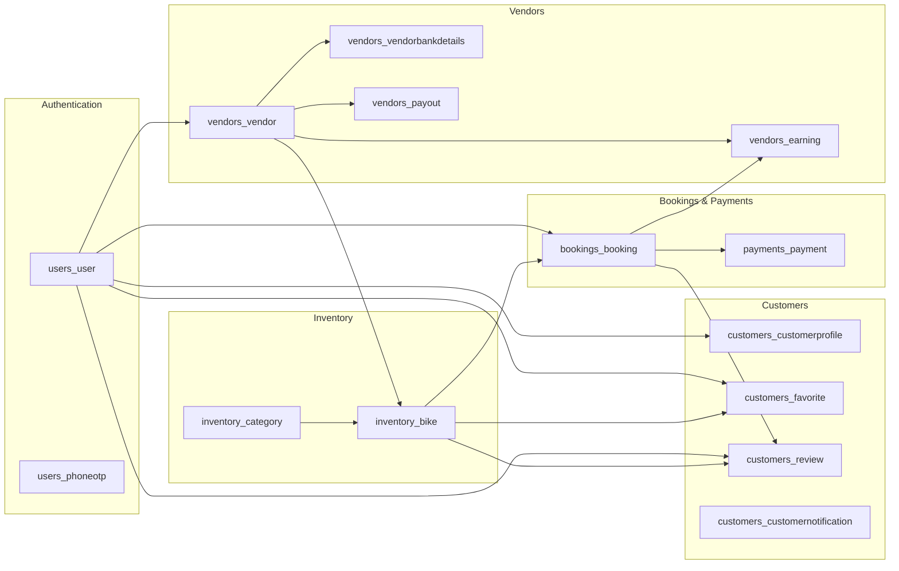

### Key Relationships

| From | To | Relationship | Description |
|------|-----|--------------|-------------|
| User | Vendor | OneToOne | User with role='vendor' has vendor profile |
| User | CustomerProfile | OneToOne | Extended customer info |
| Vendor | Bike | OneToMany | Vendor owns multiple bikes |
| Vendor | VendorBankDetails | OneToOne | Bank account for payouts |
| Vendor | Earning | OneToMany | Earnings from completed bookings |
| Category | Bike | OneToMany | Bikes belong to categories |
| User | Booking | OneToMany | Customer makes bookings |
| Bike | Booking | OneToMany | Bike can have multiple bookings |
| Booking | Payment | OneToMany | Booking has payment records |
| Booking | Earning | OneToOne | Completed booking generates earning |
| Booking | Review | OneToOne | Customer can review after completion |
| User | Favorite | OneToMany | Customer saves favorite bikes |
| Bike | Review | OneToMany | Bike accumulates reviews |

---

## Platform Commission

The platform takes a **15% commission** on each completed booking:

```
Gross Amount = Total booking amount paid by customer
Platform Fee = Gross Amount × 0.15
Net Amount = Gross Amount - Platform Fee (Goes to vendor)
```

Example:
- Customer pays: ₹1,000
- Platform fee: ₹150
- Vendor receives: ₹850

---

## Technology Stack Summary

| Layer | Technology | Version/Notes |
|-------|------------|---------------|
| **Backend Framework** | Django | 6.0+ |
| **REST API** | Django REST Framework | - |
| **Authentication** | Simple JWT | Phone OTP + JWT tokens |
| **Database** | SQLite | Development (PostgreSQL for prod) |
| **Payment Gateway** | Razorpay | Test mode |
| **KYC Verification** | DigiLocker | Mock implementation |
| **Mobile Framework** | React Native | Via Expo |
| **Navigation** | Expo Router | File-based routing |
| **Styling** | NativeWind | Tailwind for React Native |
| **State Management** | React Context | AuthContext |

---

## Security Considerations

1. **Authentication**: JWT tokens with refresh mechanism
2. **Authorization**: Role-based (customer, vendor, admin)
3. **API Protection**: IsAuthenticated permission for sensitive endpoints
4. **Payment Security**: Razorpay signature verification
5. **Data Validation**: Django serializers with validators

---

*Document generated: January 2026*
