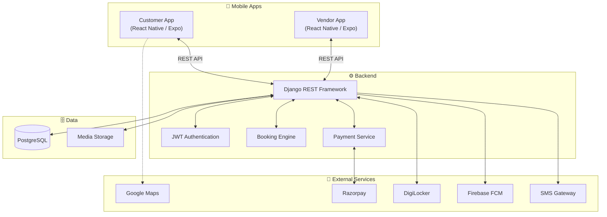
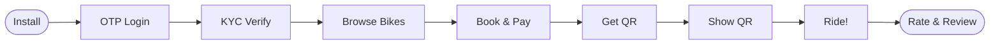
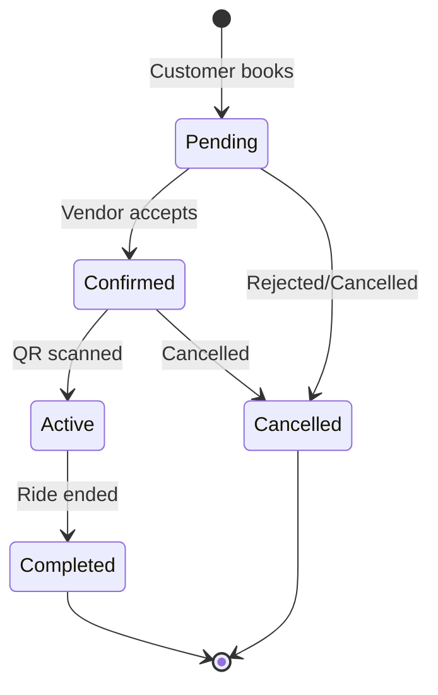
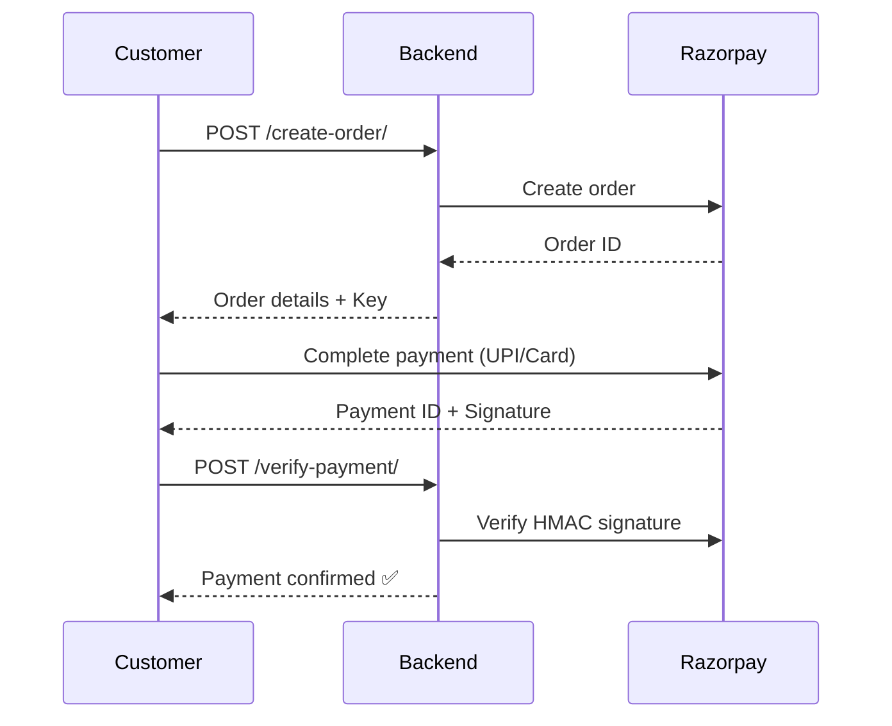
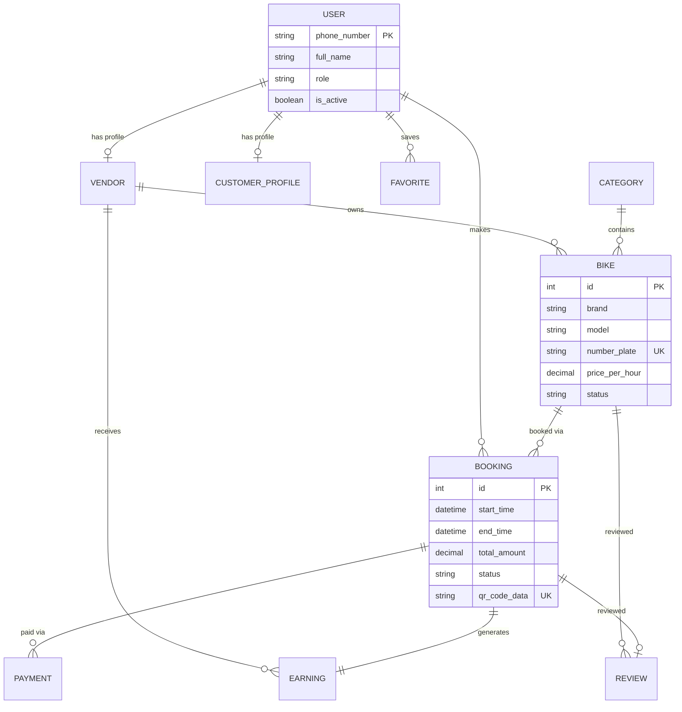

<p align="center">
  
</p>

<h1 align="center">
  🏍️ WheelGo
</h1>

<p align="center">
  <b>India's Digital-First Two-Wheeler Rental Marketplace</b><br/>
  <i>Replacing physical ID deposits with secure digital verification.</i>
</p>

<p align="center">
  
  
  
  
  
  
</p>

<p align="center">
  <a href="#-features"><b>Features</b></a> •
  <a href="#-architecture"><b>Architecture</b></a> •
  <a href="#-tech-stack"><b>Tech Stack</b></a> •
  <a href="#-getting-started"><b>Getting Started</b></a> •
  <a href="#-project-structure"><b>Structure</b></a> •
  <a href="#-api-reference"><b>API</b></a> •
  <a href="#-workflows"><b>Workflows</b></a> •
  <a href="#-contributing"><b>Contributing</b></a>
</p>

---

## 🎯 The Problem

Renting a two-wheeler in India today means:

- 📄 Handing over your **original ID card** as a deposit
- 💸 Cash-only, untracked payments
- 🤷 No visibility into bike condition or pricing
- ❌ Zero accountability for either party

**WheelGo eliminates all of this** by building a fully digital rental ecosystem where identity is verified via **DigiLocker**, payments are automated via **Razorpay**, and ride handoffs are secured through **QR code scanning**.

---

## ✨ Features

<table>
<tr>
<td width="50%">

### 📱 For Customers
- 🔐 **OTP Authentication** — Passwordless, seamless login
- 🗺️ **Map-Based Discovery** — Find bikes near you with filters
- 🏛️ **DigiLocker KYC** — One-time digital identity verification
- 📅 **Smart Booking** — Select dates, see real-time pricing
- 💳 **Razorpay Checkout** — Pay via UPI, cards, wallets
- 📲 **QR Code Pickup** — Show QR at shop, ride starts instantly
- ⭐ **Rate & Review** — Post-ride feedback system

</td>
<td width="50%">

### 🏪 For Vendors
- 📊 **Live Dashboard** — Today's bookings, active rides, earnings
- 🚲 **Fleet Management** — Add/edit bikes, toggle availability
- ✅ **Booking Control** — Accept or reject requests with reasons
- 📷 **QR Scanner** — Scan to start rides, zero paperwork
- 💰 **Earnings Tracker** — Gross, platform fee (15%), net breakdown
- 🏦 **Bank Payouts** — Request withdrawals to bank account
- 🔔 **Real-Time Alerts** — Firebase push for every booking event

</td>
</tr>
</table>

---

## 🏗️ Architecture



---

## 🛠️ Tech Stack

| Layer | Technology | Purpose |
|-------|-----------|---------|
| **Frontend** | React Native `0.81` + Expo `54` | Cross-platform mobile apps |
| **Navigation** | Expo Router `6` | File-based routing |
| **Styling** | NativeWind + Tailwind CSS | Utility-first styling |
| **Backend** | Django `6.0` + DRF | REST API & business logic |
| **Auth** | Simple JWT | Stateless token auth |
| **Database** | PostgreSQL | Relational data storage |
| **Payments** | Razorpay | UPI, cards, wallets |
| **KYC** | DigiLocker API | Government ID verification |
| **Notifications** | Firebase Cloud Messaging | Real-time push alerts |
| **Maps** | Google Maps + react-native-maps | Location & discovery |
| **State** | React Context | Auth state management |

---

## 🚀 Getting Started

### Prerequisites

- **Node.js** `18+` & **npm**
- **Python** `3.10+` & **pip**
- **PostgreSQL** `14+`
- **Expo CLI** — `npm install -g expo-cli`
- **Android Studio** / **Xcode** (for device emulation)

### 1. Clone the Repository

```bash
git clone https://github.com/aanandmodi/WheelGo.git
cd WheelGo
```

### 2. Backend Setup

```bash
# Navigate to backend
cd apps/backend

# Create virtual environment
python -m venv venv
venv\Scripts\activate   # Windows
# source venv/bin/activate  # macOS/Linux

# Install dependencies
pip install django djangorestframework djangorestframework-simplejwt
pip install psycopg2-binary python-dotenv qrcode[pil] razorpay

# Configure environment
# Create .env file with:
#   DB_NAME=wheelgo_db
#   DB_USER=postgres
#   DB_PASSWORD=your_password
#   DB_HOST=localhost
#   DB_PORT=5432

# Run migrations
python manage.py migrate

# Create admin user
python manage.py createsuperuser

# Start server
python manage.py runserver
```

### 3. Customer App Setup

```bash
# From project root
cd apps/customer
npm install
npx expo start
```

### 4. Vendor App Setup

```bash
# From project root
cd apps/vendor
npm install
npx expo start
```

### 5. Run Everything (From Root)

```bash
# Install all workspace dependencies
npm install

# Start individual apps
npm run start:customer
npm run start:vendor
```

---

## 📁 Project Structure

```
WheelGo/
├── 📦 package.json              # Root monorepo config (npm workspaces)
│
├── 📱 apps/
│   ├── customer/                 # Customer Mobile App
│   │   ├── app/                  # Expo Router screens
│   │   │   ├── (tabs)/           # Tab navigation (Home, History, Wallet, Account)
│   │   │   ├── auth/             # Login, OTP, Signup
│   │   │   ├── booking/          # Book, Confirm, QR Code
│   │   │   ├── kyc/              # DigiLocker verification
│   │   │   ├── ride/             # Active ride, Summary, Feedback
│   │   │   └── ...               # 33 screens total
│   │   ├── components/           # Reusable UI components
│   │   ├── context/              # AuthContext
│   │   └── services/             # Firebase Auth & Storage
│   │
│   ├── vendor/                   # Vendor Mobile App
│   │   ├── app/                  # Expo Router screens
│   │   │   ├── (auth)/           # Login, OTP, Setup Profile
│   │   │   ├── (tabs)/           # Dashboard, Bookings, Fleet, Profile
│   │   │   └── ...               # 16 screens total
│   │   ├── components/           # Reusable UI components
│   │   ├── context/              # AuthContext
│   │   └── services/             # Firebase Auth & Storage
│   │
│   └── backend/                  # Django REST API
│       ├── config/               # Settings, URLs, WSGI
│       ├── users/                # Auth, OTP, JWT
│       ├── customers/            # Profiles, Favorites, Reviews, Notifications
│       ├── vendors/              # Vendor profiles, Earnings, Payouts
│       ├── inventory/            # Categories, Bikes
│       ├── bookings/             # Booking lifecycle & QR
│       ├── payments/             # Razorpay integration
│       └── common/               # Shared utilities
│
├── 📄 ARCHITECTURE.md            # Detailed system architecture
├── 📄 WheelGo_Project_Context.md # Single source of truth
└── 📄 WheelGo_MVP_System_Blueprint.md
```

---

## 📡 API Reference

### 🔐 Authentication

| Method | Endpoint | Description |
|--------|----------|-------------|
| `POST` | `/api/users/send-otp/` | Send OTP to phone number |
| `POST` | `/api/users/verify-otp/` | Verify OTP & receive JWT tokens |

### 🚲 Inventory

| Method | Endpoint | Description |
|--------|----------|-------------|
| `GET` | `/api/inventory/bikes/` | Search bikes (location, price, category filters) |
| `GET` | `/api/inventory/bikes/{id}/` | Get bike details |
| `POST` | `/api/inventory/bikes/` | Add new bike *(Vendor only)* |

### 📅 Bookings

| Method | Endpoint | Description |
|--------|----------|-------------|
| `POST` | `/api/bookings/` | Create booking *(Customer)* |
| `GET` | `/api/bookings/{id}/qr-code/` | Get QR code for pickup |
| `POST` | `/api/bookings/{id}/accept/` | Accept booking *(Vendor)* |
| `POST` | `/api/bookings/{id}/reject/` | Reject booking *(Vendor)* |
| `POST` | `/api/bookings/scan-qr/` | Scan QR to start ride *(Vendor)* |
| `POST` | `/api/bookings/{id}/complete/` | End ride *(Vendor)* |

### 💳 Payments

| Method | Endpoint | Description |
|--------|----------|-------------|
| `POST` | `/api/payments/create-order/` | Create Razorpay order |
| `POST` | `/api/payments/verify-payment/` | Verify payment signature |

### 🏪 Vendors

| Method | Endpoint | Description |
|--------|----------|-------------|
| `GET` | `/api/vendors/earnings/` | View earnings history |
| `POST` | `/api/vendors/payouts/request/` | Request bank payout |

---

## 🔄 Workflows

### Customer Journey



### Booking State Machine



### Payment Flow



### Platform Commission Model

```
┌─────────────────────────────────────────────┐
│         Customer Pays: ₹1,000               │
│                                             │
│  ┌─────────────┐    ┌──────────────────┐    │
│  │ Platform Fee │    │  Vendor Revenue  │    │
│  │    15%       │    │      85%         │    │
│  │   ₹150      │    │     ₹850         │    │
│  └─────────────┘    └──────────────────┘    │
└─────────────────────────────────────────────┘
```

---

## 🗄️ Database Schema



---

## 🤝 Contributing

Contributions are welcome! Here's how to get started:

1. **Fork** the repository
2. **Create** a feature branch: `git checkout -b feature/amazing-feature`
3. **Commit** your changes: `git commit -m 'feat: add amazing feature'`
4. **Push** to the branch: `git push origin feature/amazing-feature`
5. **Open** a Pull Request

---

## 📄 License

This project is licensed under the **MIT License**.

---

<p align="center">
  <b>Built with ❤️ for India's two-wheeler rental revolution</b>
</p>

<p align="center">
  
</p>
