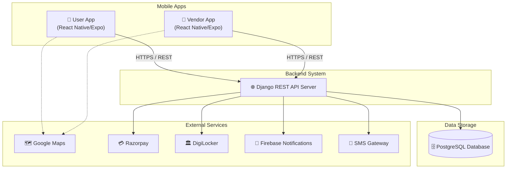
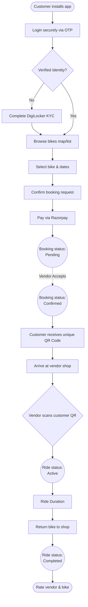
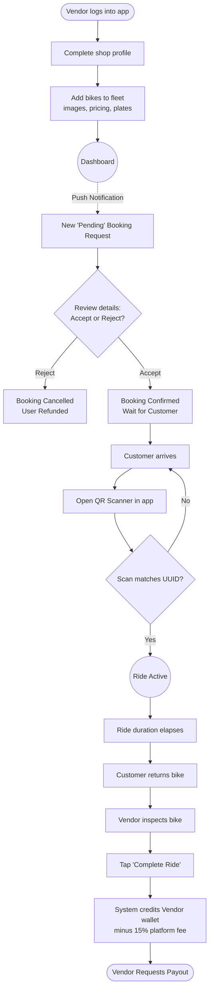
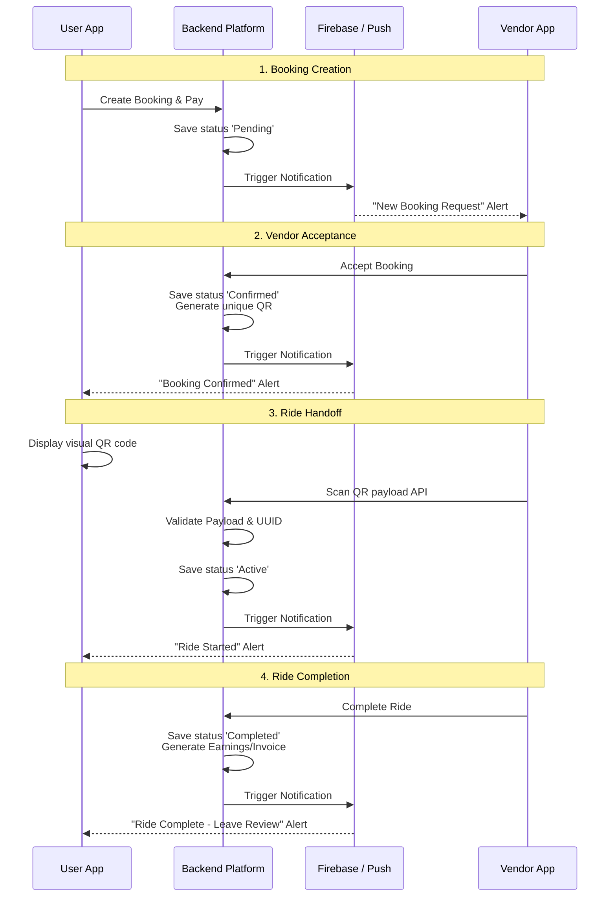

# WheelGo Project Context

## 1. Project Overview

WheelGo is a two-wheeler rental marketplace platform that connects users who want to rent bikes with local rental vendors.

The key innovation of WheelGo is replacing physical ID deposits with secure digital verification, streamlining the rental process and reducing friction for both customers and business owners.

**Key features include:**
- **Bike discovery:** Location-based search with advanced filtering for bike types, prices, and availability.
- **Online booking:** Seamless, real-time booking and reservation tracking.
- **DigiLocker based KYC:** Completely replaces physical ID deposits with secure, government-backed digital identity verification.
- **UPI payments:** Integrated, automated commission splits and digital transactions via Razorpay.
- **Vendor inventory management:** A dedicated dashboard for vendors to manage their fleets, track live bookings, and withdraw earnings.
- **QR based ride verification:** A secure, contact-less handoff mechanism where vendors scan a customer's booking QR code to initiate the ride.

**The system includes:**
- **User mobile app (React Native):** Designed for customers to browse, verify identity, book, pay, and review their rental experience. Built using Expo and NativeWind.
- **Vendor mobile app (React Native):** A business-facing tool for vendors to manage inventory, accept/reject bookings, start/end rides via QR scanning, and manage earnings. Built using Expo and NativeWind.
- **Backend API server:** A Django monolith leveraging the Django REST Framework (DRF). It acts as the central business logic layer handling authentication, orchestration, data persistence, and external service communication.
- **Database:** A relational database (PostgreSQL target, SQLite currently in dev) managing users, bookings, bikes, and payments.
- **Admin system:** The native Django Admin interface configured for platform management.
- **External services:** Incorporates Google Maps (location/discovery), Razorpay (payments/splits), DigiLocker (identity verification), Firebase (Push Notifications), and SMS Gateways (OTP Authentication).

---

## 2. Current Development Status

The platform is actively under development. Significant progress has been made on the architecture, data modeling, and frontend UIs.

| Module | Status |
|------|------|
| User App UI | Completed |
| Vendor App UI | Completed |
| Backend APIs | Partially Implemented |
| Database | Partially Implemented (Local SQLite) |
| Payment Integration | Partially Implemented |
| KYC Integration | Not Implemented |
| Notifications | Not Implemented |
| Admin Panel | Partially Implemented (Django Admin) |

### Progress Summary
- **Frontend completed:** User App UI and Vendor App UI are fully implemented with React Native, Expo Router, and NativeWind, covering all major flows (approx 33 customer screens and 16 vendor screens). 
- **Backend progress:** Django project structure is in place with 6 core apps. Data models are fully defined. Core API views for bookings (accept/reject/scan/complete) are partially built. End-to-end API integration with the frontend is pending.
- **Infrastructure:** Not fully deployed. Currently running locally with SQLite. Needs remote PostgreSQL, media storage, and cloud hosting.

---

## 3. System Architecture

WheelGo follows a standard client-server architecture with dual mobile clients interacting with a monolithic REST API.

---

## 4. User App Structure

The User App is built with React Native (Expo) and relies on Expo Router. It contains approximately 33 screens covering the complete customer lifecycle.

**Authentication:**
- `auth/login.tsx`: Phone number input.
- `auth/otp.tsx`: OTP verification screen.
- `auth/signup.tsx`: Initial user profile creation.
- `onboarding/index.tsx`: Platform introduction.

**Bike discovery:**
- `(tabs)/index.tsx`: Main home screen showing nearby bikes and categories.
- `modal.tsx`: Advanced filtering (price, category, distance, rating).
- `details.tsx`: Individual bike profile, vendor details, and prices.
- `favorites/index.tsx`: Saved/bookmarked bikes.

**Identity Verification (KYC):**
- `kyc/index.tsx`: Intro to digital KYC.
- `kyc/digilocker.tsx`: DigiLocker OAuth integration view.
- `kyc/instant.tsx`: Alternative instant verification.
- `kyc/success.tsx`: Profile verification confirmation.

**Booking flow:**
- `booking/index.tsx`: Date/time selection and pricing breakdown.
- `booking/confirmation.tsx`: Payment initialization and review.
- `booking/failure.tsx`: Transaction error state.
- `booking/qrcode.tsx`: Displays the secure QR code for vendor scanning.

**Ride experience:**
- `(tabs)/history.tsx`: Upcoming, active, and past bookings list.
- `ride/index.tsx`: Active ride dashboard map, timer, base controls.
- `ride/summary.tsx`: Post-ride invoice summary.
- `ride/feedback.tsx`: Post-ride rating system.

**User profile:**
- `(tabs)/account.tsx`: Profile management and settings.
- `notifications/index.tsx`: Inbox for alerts.
- `wallet/index.tsx`: WheelGo credits and saved payment methods.
- `terms/index.tsx`: Legal agreements.

---

## 5. Vendor App Structure

The Vendor App is dedicated to business operations. It contains approximately 17 screens tailored for fleet management and revenue tracking.

**Vendor login:**
- `(auth)/login.tsx` & `(auth)/otp.tsx`: Phone login and OTP verification.
- `(auth)/signup.tsx`: Vendor registration request.
- `(auth)/setup-profile.tsx`: Setting up shop details and location.

**Dashboard:**
- `(tabs)/index.tsx`: Overview of today's pickups, drop-offs, active rides, and pending requests.

**Booking management:**
- `(tabs)/bookings.tsx`: Multi-tab view (Pending, Upcoming, Active, Completed). Vendor actions to Accept or Reject pending bookings.
- `scan-qr.tsx`: Core operational screen. Opens the camera to scan a user's booking QR code to validate and start the ride (`Active` status).

**Bike inventory management:**
- `(tabs)/fleets.tsx`: List of all owned bikes with availability toggles.
- `add-vehicle.tsx`: Form to onboard a new bike (registration, photos, pricing).

**Earnings tracking:**
- `earnings.tsx`: Breakdown of completed rides, gross revenue, 15% platform commission deductions, and net earnings.
- `payouts.tsx`: Withdrawal history.
- `bank-details.tsx`: Secure form to update bank account for payouts.

**Vendor profile:**
- `(tabs)/profile.tsx`: Shop settings, support, and logout.

---

## 6. Backend Architecture

The Django backend is highly modularized into distinct applications (modules):

- **Authentication service (`users`):** Handles custom User models (Base, Roles: Customer/Vendor/Admin), PhoneOTP generation, and JWT token management.
- **Customer management (`customers`):** Handles `CustomerProfile`s (KYC status), `Favorite` bikes, post-ride `Review`s, and `CustomerNotification` histories.
- **Vendor management (`vendors`):** Handles `Vendor` profiles, `VendorBankDetails`, `Earning` tracking per booking, and automated `Payout` request models.
- **Bike inventory (`inventory`):** Manages `Category` classifications and the core `Bike` model, managing availability statuses and spatial query filtering for discovery.
- **Booking engine (`bookings`):** The core lifecycle manager. Transitions the `Booking` state (Pending → Confirmed → Active → Completed/Cancelled). Responsible for generating unique UUID QR codes for ride handoffs.
- **Payment system (`payments`):** Interfaces with Razorpay. Manages the `Payment` model, verification of signatures, and syncing state with the Booking engine.
- **Notification & KYC system:** Scattered across views and common utilities, interacting with Firebase Admin SDK and DigiLocker APIs.
- **Admin panel:** Django's built-in `admin.py` registrations for all models, allowing platform operators to oversee the system.

---

## 7. Database Design

Targeting PostgreSQL, the schema connects users, their business entities, vehicles, and financial records.

**Core Tables:**
- `users`: Base table storing phone numbers, roles, and active status.
- `vendors`: Linked 1:1 to User. Stores shop details, addresses, and verification status.
- `bikes`: Linked Many:1 to Vendor. Stores plates, pricing, ratings, and real-time availability status.
- `bookings`: Central connection joining User (Customer) and Bike. Stores start/end times, total amount, enum statuses, and QR code data.
- `payments`: Linked Many:1 to Booking. Stores Razorpay transaction IDs and statuses.
- `kyc_records` (via `CustomerProfile`): Stores document verification flags.
- `notifications` (`CustomerNotification`): Tracks push alerts sent to users.
- `ratings` (`Review`): Linked 1:1 to Booking, Many:1 to Bike/User. Updates Bike average rating.

**Core Relationships:**
- User (Customer) → (makes) → Booking
- Vendor → (owns) → Bikes
- Bike → (reserved via) → Booking
- Booking → (paid via) → Payment

---

## 8. API Structure

A comprehensive RESTful interface serving both mobile applications. Major endpoints include:

**Auth APIs**
- `POST /auth/send-otp/`: Send OTP to phone number.
- `POST /auth/verify-otp/`: Verify OTP & get JWT tokens.

**User APIs**
- `GET /customers/profile/`: Get customer profile.
- `POST /customers/profile/`: Update customer profile.

**Bike APIs**
- `GET /inventory/bikes/`: List bikes (with location, price, category filters).
- `GET /inventory/bikes/{id}/`: Get detailed bike info.

**Booking APIs**
- `POST /bookings/`: Create new booking.
- `GET /bookings/`: List bookings for user/vendor.
- `GET /bookings/{id}/qr-code/`: Fetch secure QR code for pickup.

**Payment APIs**
- `POST /payments/create-order/`: Initialize Razorpay checkout.
- `POST /payments/verify-payment/`: Verify webhook/signature.

**Vendor APIs**
- `GET /vendors/dashboard/`: Fetch real-time stats (today's bookings, active rides).
- `POST /inventory/bikes/`: Add a new bike to inventory.
- `POST /bookings/{id}/accept/`: Accept a pending booking.
- `POST /bookings/scan-qr/`: Scan a customer's QR to start a ride.
- `POST /bookings/{id}/complete/`: End an active ride, triggering earnings calculations.

---

## 9. External Integrations

Third-party services are critical to WheelGo's operations:

- **Google Maps:** Used heavily on the User App for bike discovery (map view), filtering by radius, and navigation. Backend utilizes spatial data for distance calculations.
- **Razorpay:** Used for robust payment processing. Handles customer checkout securely and manages the automated commission split (e.g., 15% platform fee, 85% to vendor) via Razorpay Route.
- **DigiLocker:** Used for mandatory identity verification. Ensures the customer is a verified Indian citizen with a valid Driving License/Aadhaar before allowing high-value bike rentals.
- **Firebase:** Central to the communication loop. Used for real-time Push Notifications (e.g., alerting a vendor of a new booking, or a customer that their ride has been accepted).
- **SMS Gateway:** (e.g., Twilio/Msg91) Used exclusively for delivering 6-digit OTPs for passwordless, secure authentication.

---

## 10. User Flow

The complete journey for a Customer is mapped out below:

### Detailed Steps:
1. Customer installs the app.
2. Customer logs in securely with OTP.
3. Customer verifies identity via DigiLocker (one-time process).
4. Customer browses available bikes via list or map.
5. Customer selects a bike, reviews vendor ratings, and chooses dates.
6. Customer confirms the booking request.
7. Customer pays via Razorpay (UPI/Card). Booking is now `Pending`.
8. Once Vendor accepts, the Customer receives a unique QR code.
9. Customer arrives at the shop; Vendor scans the QR code.
10. Ride starts (`Active` status).
11. Customer returns the bike; Vendor ends the ride.
12. Customer rates the vendor and the bike (`Completed` status).

---

## 11. Vendor Flow

The lifecycle for a Rental Business Owner:

### Detailed Steps:
1. Vendor logs into the business app.
2. Vendor sets up their shop profile and adds bikes to their inventory (images, pricing, plates).
3. Vendor receives a push notification for a new `Pending` booking request.
4. Vendor reviews the dates/bike and accepts the booking.
5. Customer arrives; Vendor taps "Scan QR" and scans the customer's app.
6. Ride begins, bike status updates to `Active`.
7. Customer returns the bike; Vendor taps "Complete Ride".
8. System automatically calculates the 15% WheelGo fee, and the Vendor receives the net payment in their Earnings dashboard.

---

## 12. Communication Between Apps

The dynamic nature of the marketplace requires real-time state synchronization between the User App and the Vendor App, orchestrated heavily by the Backend and Firebase.

**Key Interactions Explained:**
- **Booking Creation:** User booking → backend updates DB → backend triggers Firebase → Vendor receives "New Booking" notification.
- **Acceptance:** Vendor hits Accept → backend updates DB → backend triggers Firebase → User receives "Booking Confirmed" notification and QR code is unlocked.
- **Ride Start:** Vendor scans QR → backend validates → backend updates DB status → User app updates to show live ride dashboard.

---

## 13. Beta Launch Requirements

Minimal requirements to launch a functional Beta (e.g., 1 city, 10 vendors, 100 users):

**Must have:**
- Reliable OTP Authentication.
- Functional bike listing and filtering.
- End-to-end Booking state machine (Pending → Confirmed → Active → Complete).
- Razorpay Payment integration.
- Vendor dashboard (Accept/Reject bookings, Manage Fleet).
- Secure QR verification handoff.
- Real-time Notifications.

**Nice to have (Not strictly required for Beta):**
- Post-ride Ratings.
- In-App Wallet and WheelGo Credits.
- Complex analytic dashboards for Vendors.
- Admin automation and automated refunds.

---

## 14. Remaining Work

The project requires significant integration plumbing and infrastructure setup.

**Frontend remaining:**
- Connect UI states to live API endpoints (currently heavily reliant on unlinked state/hooks).
- Implement robust state management (React Context/Zustand) for the booking lifecycle.
- Implement comprehensive Error handling, network drop scenarios, and loading skeletons.
- Complete the Razorpay Native SDK integration.

**Backend remaining:**
- Build out complete authentication API views using Simple JWT.
- Finalize the Booking engine edge cases (e.g., auto-cancelling unpaid bookings).
- Implement Razorpay webhook validation logic.
- Implement DigiLocker API integration logic.
- Implement Firebase Admin SDK for triggering push notifications.

**Infrastructure remaining:**
- Provision a production database (PostgreSQL on AWS/Neon).
- Setup cloud object storage for Media and QR codes (AWS S3/Cloudinary).
- Build and configure Deployment pipelines (Docker, GitHub Actions, AWS EC2/Render).
- Configure application logging and security hardening.

---

## 15. Risk Areas

Potential weak points and mitigation strategies:

- **Payment failures:** Payments dropping mid-transaction.
  *Mitigation:* Implement robust webhook listeners from Razorpay and strict reconciliation scripts.
- **Double booking:** Two users booking the same bike for the same time.
  *Mitigation:* Apply strict database-level constraints, atomic transactions, and overlapping time range queries during booking creation.
- **Vendor fraud / Non-compliance:** Vendors rejecting too many bookings or marking rides complete early.
  *Mitigation:* Track vendor acceptance rates; introduce penalties or auto-suspensions for poor behavior.
- **Identity verification issues:** User faking ID.
  *Mitigation:* Strictly enforce DigiLocker KYC; vendors must cross-check the app profile photo during the physical handoff.
- **QR Scan Failures:** Camera or internet issues at the shop.
  *Mitigation:* Provide a fallback 6-digit manual PIN code system.

---

## 16. Beta Launch Plan

A phased approach to reaching the Beta Launch:

- **Phase 1: Backend Core APIs (Weeks 1-2)**
  - Finalize Auth, DB models, and basic CRUD APIs.
- **Phase 2: Booking Engine (Weeks 3-4)**
  - Implement full state machine, QR generation, and connect frontend API calls.
- **Phase 3: Payment Integration (Week 5)**
  - Integrate Razorpay, verify webhooks, and finalize earning splits.
- **Phase 4: Integrations & Notifications (Week 6)**
  - Implement DigiLocker, Firebase Push Notifications, and error handling.
- **Phase 5: Vendor Onboarding & UAT (Week 7)**
  - Internal testing, onboarding 10 initial vendors in the target city, and adding inventory.

**Beta Target:** 10 vendors, 50–100 users, 1 city.

---

## 17. Progress Tracking Checklist

Developers can update this checklist as milestones are reached:

### Frontend
- [x] User screens completed (Mockups to Code)
- [x] Vendor screens completed (Mockups to Code)
- [ ] API integration: Authentication
- [ ] API integration: Discovery & Booking
- [ ] API integration: Vendor Dashboard & QR Scanner

### Backend
- [ ] Auth service fully tested
- [ ] Booking engine edge cases handled
- [ ] Payment service (Razorpay webhooks)
- [ ] Notification service (Firebase triggers)
- [ ] KYC Service (DigiLocker integration)

### Infrastructure
- [x] Local development environment
- [ ] Database deployed (PostgreSQL)
- [ ] Backend deployed (Domain, SSL, Cloud)
- [ ] Monitoring and alerting enabled
